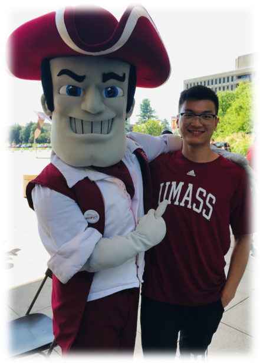
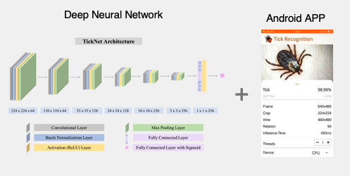
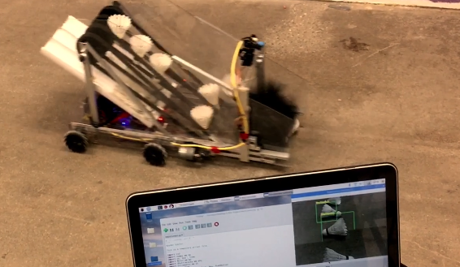
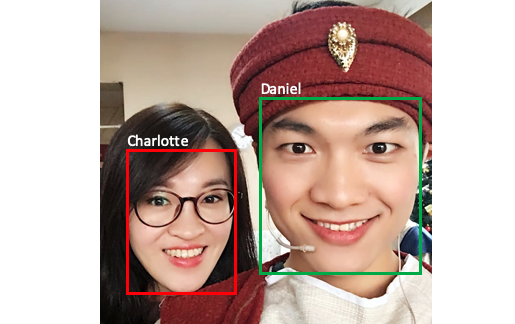

<!--
*** Thanks for checking out the Best-README-Template. If you have a suggestion
*** that would make this better, please fork the repo and create a pull request
*** or simply open an issue with the tag "enhancement".
*** Thanks again! Now go create something AMAZING! :D
-->

<h1 align="center">Hi , I'm Xi Wang</h1>
 <p align="center"><br/>
   <a href="https://www.linkedin.com/in/xidaniel">
    
  </a>
  
  <a href="https://www.algoxi.com">
    
  </a>
</p>

<h3 align="center">A passionate software developer in the United States</h3>
<h3 align="center">Master of Science, Computer Engineering (Expected to graduate in May 2021)</h3>



## About Me
I am currently learning University of Massachusetts Amherst (UMass) as a graduate student in Computer Engineering major.
I have an interests in **full-stack development, cloud computing, machine learning**, and **deep learning**.


## Unique Projects

<table style="width:100%; table-layout:fixed">
  <tr>
    <th>AI-Based Video Analysis System</th>
    <th>Tick Recognition Application</th>
    <th>Intelligent Robot Collector </th>
  </tr>
  <tr>
    <td>
		<a href="https://github.com/">
			
		</a>
	</td>
    <td>
		<a href="https://github.com/">
			
		</a>
	</td>
    <td>
		<a href="https://github.com/">
			
		</a>
	</td>
  </tr>
	
  <tr>
    <th>Movie Recommendation System</th>
    <th>PhDOffer Moile Application</th>
    <th>Face Detection</th>
  </tr>
  <tr>
    <td>
		<a href="https://github.com/">
			
		</a>
	</td>
    <td>
		<a href="https://github.com/">
			
		</a>
	</td>
    <td>
		<a href="https://github.com/">
			
		</a>
	</td>
  </tr>	
</table>


## Programming Languages: 


## Technologies and Frameworks: 


## Desktop Environment:
<p align="left">
  
  
  
  
  
  
  
  
  
</p>

## I’m currently learning:


⭐️ From [Xi Wang](https://github.com/xidaniel)   ```Leon```
